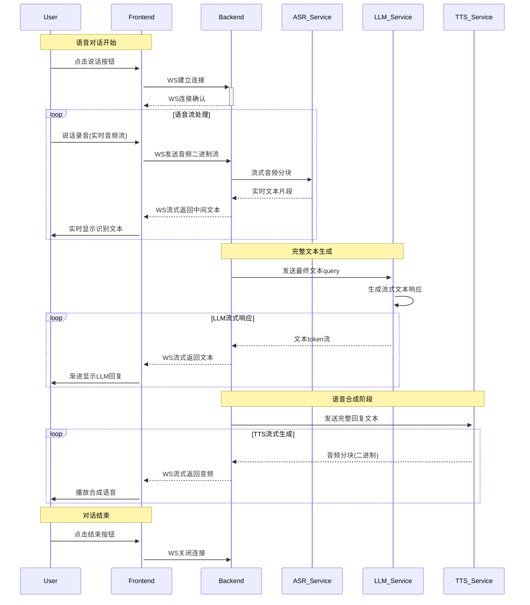

# Voice Chat 🎙️

一个基于Spring AI Alibaba的实时语音对话系统，集成了阿里云语音识别(ASR)、百炼云平台RAG知识库、通义千问大语言模型和语音合成(TTS)服务。


[演示视频](https://www.bilibili.com/video/BV13vuzzNEAy/)

## ✨ 特性

- 🎯 实时语音识别 (ASR)
- 💬 智能对话 (基于通义千问)
- ☁️ 快速云知识库（RAG）
- 🔊 自然语音合成 (TTS)
- 🔄 WebSocket实时通信
- 🛡️ 多客户端并发支持
- 🔍 智能错误恢复机制



## 🚀 快速开始

### 环境要求

- JDK 17+
- IntelliJ IDEA 2023+
- Spring Boot 3.2+

### 配置
- 在阿里云百炼平台设置api-key
  在 `src/main/resources/config/application.yml` 中配置以下参数：

```yaml
spring:
  ai:
    dashscope:
      api-key: your-api-key-here

server:
  port: 8443

# 安全码，记得修改
chat:
  security: deGa2025
```

### 运行项目

1. 使用IDEA打开项目
2. 等待Maven下载依赖
3. 运行 `VoiceChatApplication` 主类
4. 访问 `https://localhost:8443` 即可使用语音对话系统

## 🎮 使用方式

系统提供了完整的Web界面，支持以下功能：

- 实时语音识别
- 智能对话
- 语音合成播放
- 对话历史记录

## 🤖 自定义系统提示词、回答音色
- 提示词替换位置：src/main/resources/static/prompt/localization.txt
- 回答音色替换： src/main/java/com/xc/voicechat/tts/TTService.java
- 音色列表：https://help.aliyun.com/zh/model-studio/cosyvoice-java-sdk#722dd7ca66a6x
- 项目中使用到的模型也可以快速替换或者使用免费sdk,本地模型等，自行探索

## 📱手机使用

- 确保手机与后端服务在同一局域网（比如连同一个WiFi）
- 修改index.html中后端url为局域网地址


## 🏗️ 系统架构

```
┌─────────────┐     ┌─────────────┐     ┌─────────────┐
│  客户端     │     │  WebSocket  │     │  服务端     │
│  (浏览器)   │◄────┤   服务器    │◄────┤  (Spring)   │
└─────────────┘     └─────────────┘     └─────────────┘
                                                    │
                                                    ▼
┌─────────────┐     ┌─────────────┐     ┌─────────────┐
│  语音生成   │◄────┤  通义千问   │◄────┤ 语音识别    │
│  (TTS)      │     │  (LLM)      │     │  (ASR)      │
└─────────────┘     └─────────────┘     └─────────────┘
```

## RAG
- 项目中能快速使用阿里云知识库，快速实现RAG

## 🔧 技术栈

- **后端框架**: Spring Boot 3.2
- **WebSocket**: Spring WebSocket
- **语音识别**: 阿里云ASR
- **大语言模型**: 通义千问
- **语音合成**: 阿里云TTS
- **构建工具**: Maven
- **日志框架**: SLF4J + Logback

## 📦 项目结构

```
voice-chat/
├── src/
│   ├── main/
│   │   ├── java/
│   │   │   └── com/xc/voicechat/
│   │   │       ├── asr/          # 语音识别服务
│   │   │       ├── tts/          # 语音合成服务
│   │   │       └── websocket/    # WebSocket处理
│   │   └── resources/
│   │       ├── static/          # 静态资源（Web界面）
│   │       └── application.yml  # 配置文件
│   └── test/                    # 测试代码
├── pom.xml                      # 项目依赖
└── README.md                    # 项目文档
```

## 🔍 错误处理

系统实现了智能的错误恢复机制：

- ASR服务自动重连
- 资源自动清理
- 异常状态恢复
- 详细的错误日志

## 🤝 贡献指南

1. Fork 本仓库
2. 创建特性分支 (`git checkout -b feature/AmazingFeature`)
3. 提交更改 (`git commit -m 'Add some AmazingFeature'`)
4. 推送到分支 (`git push origin feature/AmazingFeature`)
5. 开启 Pull Request

## 📝 许可证

本项目采用 MIT 许可证 - 查看 [LICENSE](LICENSE) 文件了解详情

## 👥 作者

- **磷光水母** - [gitee](https://gitee.com/huihuisire)

## 🙏 致谢

- 阿里云语音服务
- 通义千问大语言模型
- Spring Boot 团队
- 所有贡献者 
